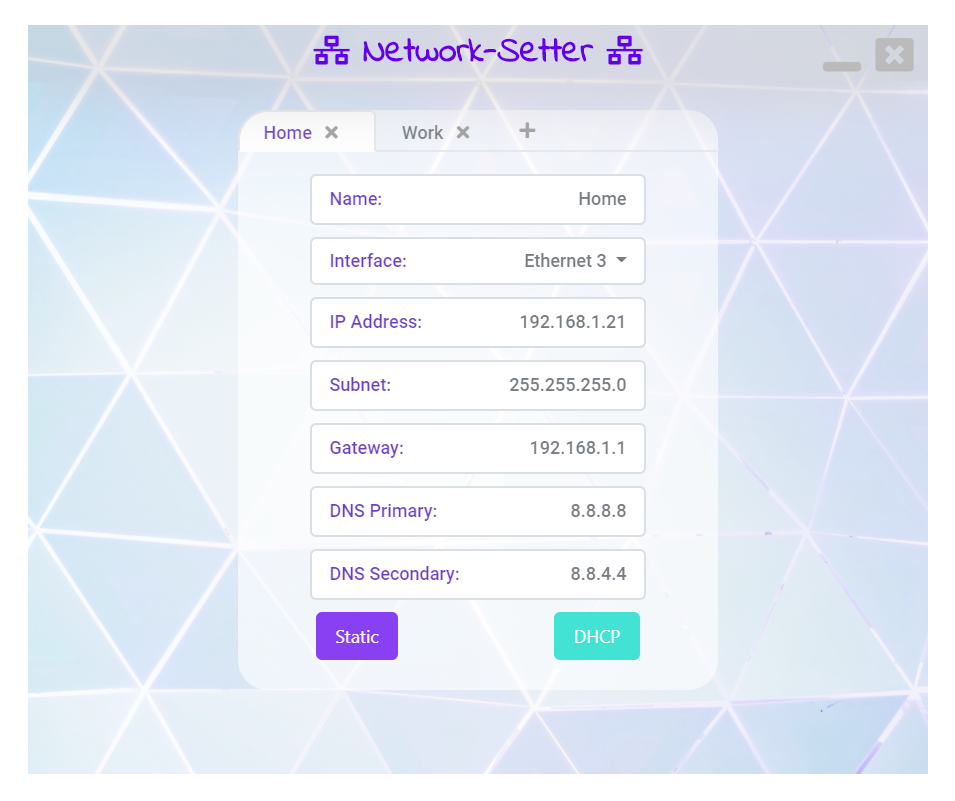

# NetworkSetter

# Summary
Windows application for storing network adaptor IP settings. Helps switch networks faster. No more remembering your work or customers site IP address. Just use the app to store them and easily switch between them.
# Getting Started
There are two ways you can get the application.
* Download the application from the release section, unzip and run the NetworkSetter.exe
* Download the Visual Studio project source code and build it yourself.

Once you have the application started if you just give each configuration a name then select your network adapter from the drop down and
enter your IP settings.

# Versions
## V1.0.0 Supports

* Static IP Addresses
  * IP Address
  * Subnet
  * Gateway
* DHCP - Automatic IP addressing
